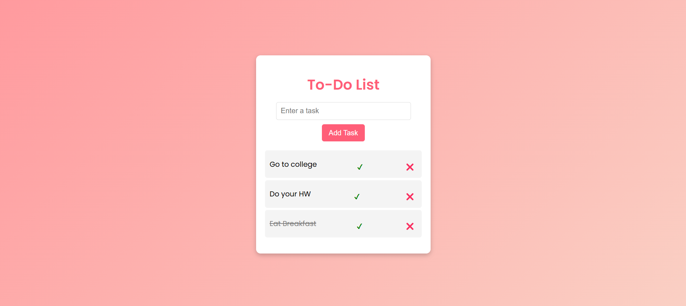
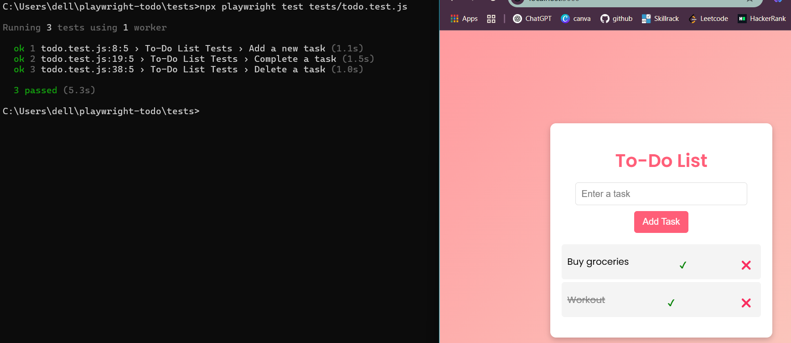

# 📝 To-Do List App with Playwright Testing  

## 🌟 Overview  
This project is a simple yet functional **To-Do List Web Application** built with **Node.js, Express, and Playwright**. It allows users to **add, complete, and delete tasks**, with completed tasks smoothly moving to the bottom for a better user experience.  

We also use **Playwright** for automated end-to-end testing to ensure that the application's core functionalities work as expected.  

---

## 🎭 What is Playwright?  
[Playwright](https://playwright.dev/) is a powerful **open-source automation framework** for web testing. Developed by Microsoft, it enables testing across multiple browsers like **Chromium, Firefox, and WebKit** with a single API.  

It provides **fast, reliable, and headless execution** while supporting modern web testing features like:  
✅ Cross-browser testing (Chrome, Edge, Firefox, Safari)  
✅ Headless & UI mode execution  
✅ Visual regression testing  
✅ Network interception and debugging  

### 📖 **Learn Playwright**  
- **Official Documentation**: [https://playwright.dev/](https://playwright.dev/)  
- **GitHub Repository**: [https://github.com/microsoft/playwright](https://github.com/microsoft/playwright)  
- **Getting Started Guide**: [https://playwright.dev/docs/intro](https://playwright.dev/docs/intro)  

---

## 🚀 Project Features  
✅ **Add, complete, and delete tasks**  
✅ **Smooth UI animations when tasks are completed**  
✅ **Node.js and Express backend for API handling**  
✅ **Automated testing using Playwright**  
✅ **Cross-browser compatibility**  

---

## 🛠️ Tech Stack  
- **Frontend**: HTML, CSS, JavaScript  
- **Backend**: Node.js, Express.js  
- **Database**: In-memory storage (Can be extended to SQLite/MongoDB in future)  
- **Testing Tool**: Playwright  

---

## 📸 Screenshots  
### 🏠 **Home Page**  
  

### ✍ **Testing page by Playwright**  
  

---

## ⚙️ Installation & Setup  

### 🔹 **1. Clone the Repository**  
```sh
git clone https://github.com/sarah131/playwright-todo-app.git
cd playwright-todo-app
```
### 🔹 **2. Follow the documentation present in the repository itself**  

## Do follow for more and Refer 
For projects : [Github](https://github.com/sarah131/)

For coding skills & Problem solving : [Youtube](https://youtube.com/@theengineeringcodex?si=5o6xpI8eqK7-2fQf)
